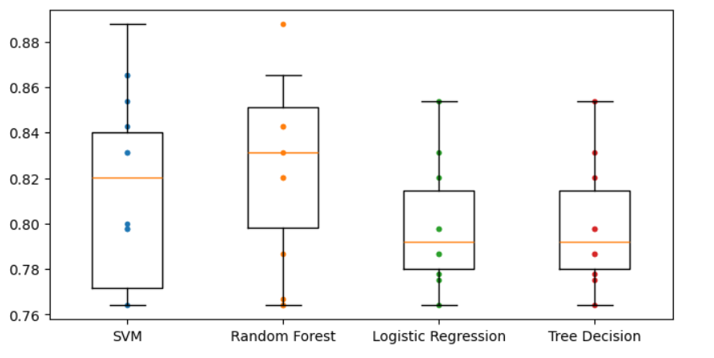

# Titanic - Machine Learning from Disaster

This is a very popular project about predicting human survival in the Titanic disaster. Data is taken from Kaggle.

Link to DataSet: https://www.kaggle.com/c/titanic/overview

In this project, 4 classification models were used to predict human survival in that disaster. These include:
- Supper Vector Machine (SVM)
- Random Forest
- Logistic Regression
- Tree Decision

After training the models and using cross validation to calculate the errors of the models, boxplot to compare the errors when using the models:

